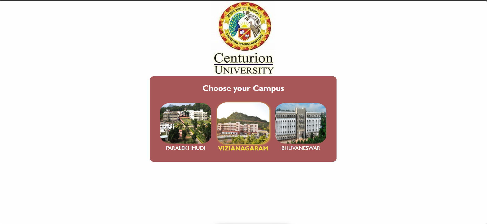
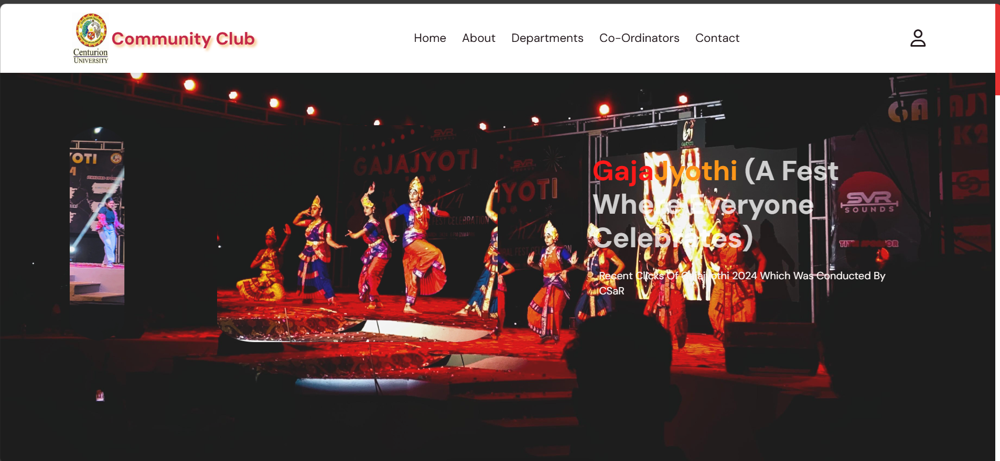

# University Campus Portal

A simple web portal for selecting a university club portal. This project was developed during my second year of college to practice fundamental web development skills.

---

## About The Project

This project is a user-facing interface that allows a student to select their university campus from a list of options (Paralekhmundi, Vizianagaram, Bhubaneswar). Upon selection, the user is redirected to a campus-specific homepage.

The original project included a PHP and MySQL backend for user registration and login, but this repository contains a static version focused on the HTML, CSS, and JavaScript frontend.

### Key Features:
*   Clean, card-based UI for campus selection.
*   Interactive elements using JavaScript.
*   Responsive design for different screen sizes.
*   Detailed sections for departments, clubs, and contact information.

---

## Project Navigation

### Original Intended Flow
The complete user journey was designed to be a dynamic experience:
1.  **Sign Up & Login:** A new user would start at the `signup.html` page to create an account and log in.
2.  **Campus Selection:** After logging in, they would be directed to `userpage.html` to choose their campus.
3.  **Homepage:** Finally, they would land on the main dashboard at `responsive-homepage/index.html`.
4.  **Explore & Interact:** From the homepage, users could explore academic departments, find clubs within those departments, and register for clubs they were interested in by providing their details. They could also contact administrators or coordinators.

### How to View This Static Demo

**Since the backend is not active, the registration and login flow is disabled.**

To explore the project's frontend and UI, please **start by opening the `responsive-homepage/index.html` file directly in your browser.**

From there, you can navigate through the different static pages to see the UI for the departments, clubs, and contact sections as they were designed.

---

## Screenshots

*(It's highly recommended to add screenshots here to show off your work!)*

**Campus Selection Page:**

**Homepage:**

---

## Built With

This project was built using the following technologies:

*   **Frontend:** HTML5, CSS3, JavaScript
*   **Original Backend (Not active in this repo):** PHP, MySQL

---

## About Me

*   **Name:** Manda Vamsi Krishna
*   **LinkedIn:** [Vamsi Krishna Manda](https://www.linkedin.com/in/vamsi-krishna-manda-65b391267/)

I am a passionate developer interested in full-stack development, with a particular focus on creating AI-native web applications. I believe in leveraging modern tools, including AI assistance, to build software more efficiently and effectively. This project was a foundational learning experience for me in building dynamic web applications from scratch.
